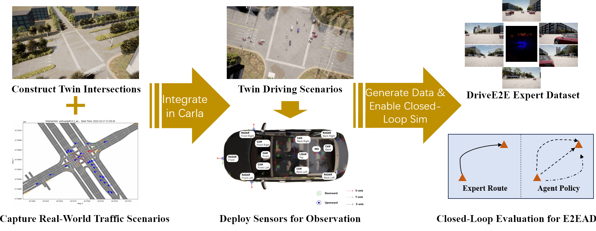

# DriveE2E: Benchmarking Closed-Loop End-to-End Autonomous Driving with Infrastructure Cooperation
*A simple yet challenging closed-loop evaluation framework that closely integrates real-world driving scenarios into the CARLA simulator, effectively bridging the gap between simulated and real-world driving environments.*

<div align="center">
  
</div>


This repository contains code for the paper "DriveE2E: Benchmarking Closed-Loop End-to-End Autonomous Driving with Infrastructure Cooperation". This work introduce a simple yet challenging closed-loop evaluation framework that closely integrates real-world driving scenarios into the CARLA simulator, effectively bridging the gap between simulated and real-world driving environments. 

## Contents
1. [Setup](#Setup)
2. [Evaluation](#evaluation)

## Setup 
### Carla
  - Download `CarlaWithDriveE2EAssets` for direct use.
  - Add `export CARLA_ROOT=CarlaWithDriveE2EAssets` to your `~/.bashrc`.
### Model
- Refer to [Uniad/VAD](https://github.com/Thinklab-SJTU/Bench2DriveZoo) in Bench2Drive 
- Refer to [TCP/ADMLP](https://github.com/Thinklab-SJTU/Bench2DriveZoo/tree/tcp/admlp) in Bench2Drive


## An Example of Evaluation
### Data Preparation
- Download `DynamicTrafficScenarios` Datasets, then follow the steps below to prepaer the validate data.

```bash
cd DriveE2E
mkdir data
mv DynamicTrafficScenarios/clip_data_NeurIPS2025_200 data/
mv DynamicTrafficScenarios/drive_e2e_xmls_val_200 data/
```

### Evaluation
- Multi-Process Multi-GPU Parallel Evaluation
```bash
    nohup bash leaderboard/scripts/run_evaluation_multi.sh > ./logs/eva.out &
```
Please configure the following key arguments in leaderboard/scripts/run_evaluation_multi.sh before running:

`ALGO` — Agent type. Options: expert, uniad, vad, mlp, tcp

`GPU_IDS` — Specify the GPU IDs to use (e.g., 0,1,2)

`DATA_VERSION` — Used for dataset saving

`PLANNER_TYPE` — Required when ALGO=tcp. Options:
* ctrl
* traj
* merge_ctrl_traj

`DRIVEE2E_SCENARIO_ROOT` — Path to scenario data
* Example: data/clip_data_NeurIPS2025_200

`directory` — Path to scenario XMLs
* Example: data/drive_e2e_xmls_val_200

`TEAM_CONFIG` — Set the model checkpoint path in TEAM_CONFIG.

`SAVE_PATH` — Set to None to disable image saving during closed-loop evaluation


## Acknowledgements
This implementation is based on code from these repositories.
- [Bench2Drive](https://github.com/Thinklab-SJTU/Bench2Drive)
- [Bench2DriveZoo](https://github.com/Thinklab-SJTU/Bench2DriveZoo)
- [carla-simulator/leaderboard](https://github.com/carla-simulator/leaderboard)


