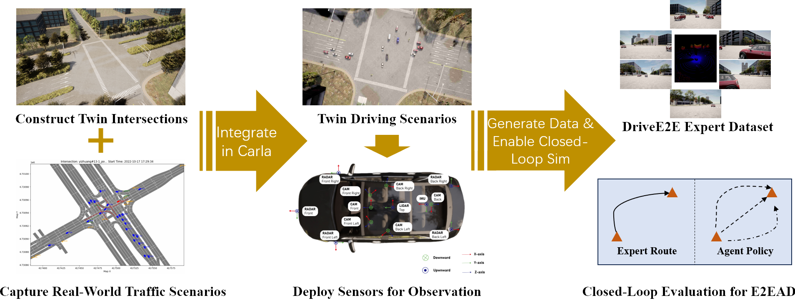

# DriveE2E: Benchmarking Closed-Loop End-to-End Autonomous Driving Based-on Real-World Traffic Scenarios
*A simple yet challenging closed-loop evaluation framework, which closely integrates real-world driving scenarios into the CARLA simulator, effectively bridging the gap between simulated and real-world driving environments.*

<div align="center">
  
</div>


This repository contains code for the paper "DriveE2E: Benchmarking Closed-Loop End-to-End Autonomous Driving Based-on Real-World Traffic Scenarios". This work introduce a simple yet challenging closed-loop evaluation framework that closely integrates real-world driving scenarios into the CARLA simulator, effectively bridging the gap between simulated and real-world driving environments. 

## Contents
1. [Setup](#Setup)
2. [Evaluation](#evaluation)

## Setup
  - Download Twin Intersection Maps: DriveE2ETown*_0.9.15*.tar.gz
  - Download and setup CARLA 0.9.15
    ```bash
        mkdir carla
        cd carla
        wget https://carla-releases.s3.us-east-005.backblazeb2.com/Linux/CARLA_0.9.15.tar.gz
        tar -xvf CARLA_0.9.15.tar.gz
        cd Import 
        cp -r DriveE2ETown*_0.9.15*.tar.gz .
        cd .. && bash ImportAssets.sh
        export CARLA_ROOT=YOUR_CARLA_PATH
        echo "$CARLA_ROOT/PythonAPI/carla/dist/carla-0.9.15-py3.7-linux-x86_64.egg" >> YOUR_CONDA_PATH/envs/YOUR_CONDA_ENV_NAME/lib/python3.7/site-packages/carla.pth # python 3.8 also works well, please set YOUR_CONDA_PATH and YOUR_CONDA_ENV_NAME
    ```

## Evaluation
- Multi-Process Multi-GPU Parallel Eval
```bash
    nohup bash leaderboard/scripts/run_evaluation_multi.sh > ./logs/eva.out &
```


## Acknowledgements
This implementation is based on code from these repositories.
- [Bench2Drive](https://github.com/Thinklab-SJTU/Bench2Drive)
- [Bench2DriveZoo](https://github.com/Thinklab-SJTU/Bench2DriveZoo)
- [carla-simulator/leaderboard](https://github.com/carla-simulator/leaderboard)


